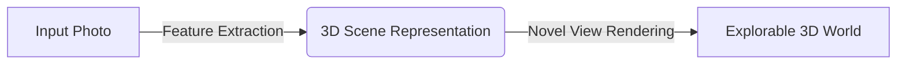

# WorldDiff

A pose-conditioned multi-view diffusion model, trained and built from scratch, feeding a 3D-Gaussian-Splatting fit.
the Primary aim:

---

## Inspiration

The following project came into fruition because I was bored and I'm trying to get into AI Research, maybe build a startup, no other special reason. I thought of this and thought it was really cool.

---

## Scope

The following project could be used in verticals like:4

- Interior Design
- Gaming and Asset Design
- Construction, etc.

It could also be a component in something bigger (and cooler).

If we want to be really professional about it, we could go about defining scope as such.

- Implementing the Architecture
- Camera Conditioning
- Cross-View Consistency
- Training Objective and Loop
- Training in bounded domain with modest resolution

Damn, that was tiring, I'll cut down on using jargons cause it hurts my head and I'm not really that smart.

---

I'll add the plan-docs/roadmaps eventually! Stay Tuned...

---

## References

1. **DiT — Scalable Diffusion Models with Transformers** — Peebles & Xie, ICCV 2023.

2. **Flow Matching for Generative Modeling** — Lipman et al., ICLR 2023.

3. **Flow Straight and Fast: Rectified Flow** — Liu, Gong, Liu, ICLR 2023.

4. **High-Resolution Image Synthesis with Latent Diffusion (LDM)** — Rombach et al., CVPR 2022.

5. **Classifier-Free Diffusion Guidance** — Ho & Salimans, 2022.

6. **3D Gaussian Splatting for Real-Time Radiance Field Rendering** — Kerbl et al., SIGGRAPH 2023.

7. **Cameras as Rays: Pose Estimation via Ray Diffusion** — Zhang et al., ICLR 2024.

8. **MVDream: Multi-view Diffusion for 3D Generation** — Shi et al., 2023.

9. **ViewCrafter: Taming Video Diffusion for Novel View Synthesis** — TPAMI 2025.

10. **Wonderland: Navigating 3D Scenes from a Single Image** — 2024.

11. **DDPM** — Ho, Jain, Abbeel, NeurIPS 2020.

12. **Score-Based Generative Modeling through SDEs** — Song et al., ICLR 2021.

13. **DDIM** — Song, Meng, Ermon, ICLR 2021.

14. **Elucidating the Design Space of Diffusion (EDM)** — Karras et al., NeurIPS 2022.

15. **Auto-Encoding Variational Bayes (VAE)** — Kingma & Welling, 2013.

Yes I actually read these papers, fight me. (I accidentally read all before writing even a single line of code).
